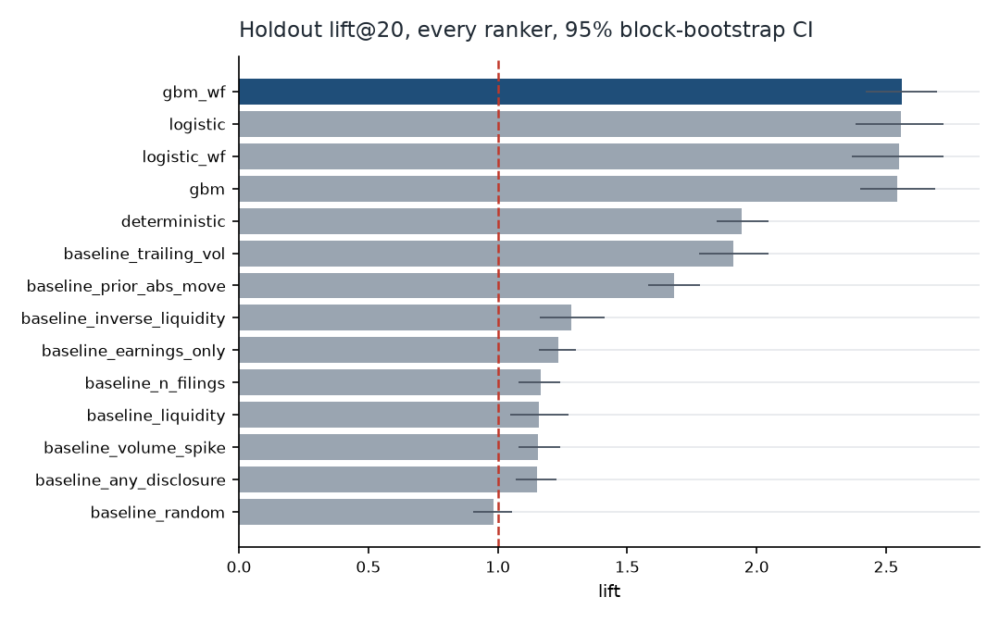
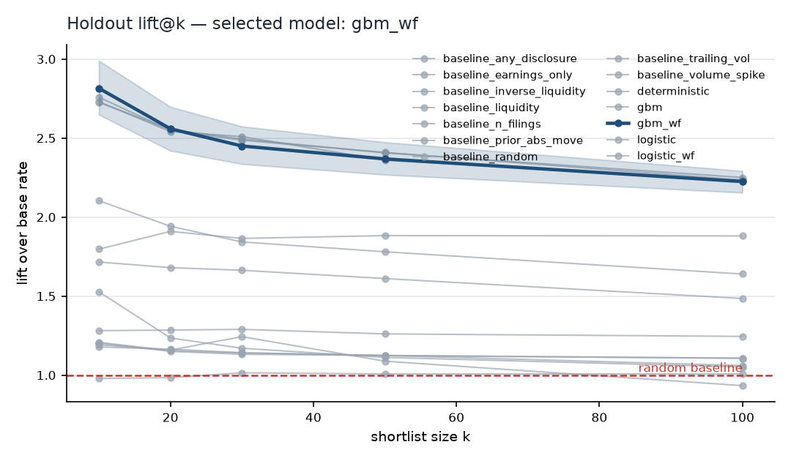
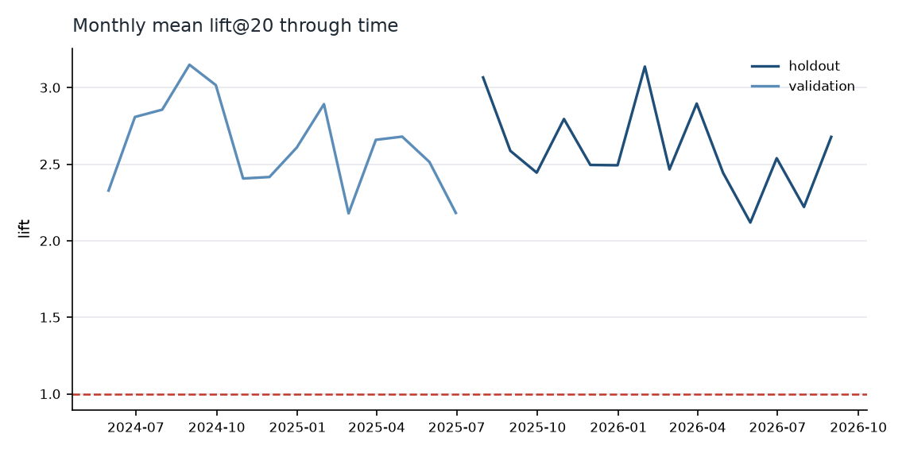

# exp1_simulation_control — evidence package

> **SIMULATED DATA.** This run was produced from the synthetic corpus in
> `ziggy/simulate.py`. It validates the pipeline and the evaluation harness
> end to end and acts as a positive control. **It is not evidence about real
> markets.** See `REPORT.md` for the real-data run.

_Generated 2026-09-13T05:55:57.205614+00:00 · config `configs/simulation.yaml` · runtime 883.6s_

## The question

> Given everything publicly knowable at the snapshot, can we automatically
> produce a short ranked list of situations that contains substantially more
> consequential future market activity than a naive baseline?

## Verdict: YES

The ranking finds substantially more consequential activity than chance (lift@20 CI lower bound 2.44 > 1.0), and it beats the hardest naive alternative (`trailing_vol`) by +0.676 lift [0.521, 0.843], p=0.0010. A shortlist of 20 is worth the reasoning budget.

## Headline result

On the **holdout** period (2025-07-15 → 2026-08-31, 285 sessions), ranking with **gbm_wf** and taking the top **20** names per snapshot:

- **precision@20 = 0.259** [0.245, 0.275] against a base rate of 0.100

- **lift@20 = 2.59×** [2.44, 2.74]

- **5.2** of the 20 shortlisted names were consequential on an average day

- the shortlist captured **2.4%** of the day's total absolute excess movement while being 1.5% of the universe (**1.61×** its share)

- selected names moved **1.61×** as far as the average name


Against the **hardest** of the nine naive baselines (`trailing_vol`), the selected model clears it by **+0.676** lift [0.521, 0.843], p=0.0010 (significant, paired block bootstrap over the same 280 sessions). Beating `random` is table stakes; this is the comparison that decides whether the layer is worth building.






## Protocol

- Snapshot convention: **20:00 America/New_York**; the earliest action is the next session's open.

- Period 2021-01-01 → 2026-08-31; 1421 snapshots, 1,934,936 candidate rows, 1362 names ranked per snapshot.

- Chronological splits with a 21-session embargo: train 2021-01-04→2024-04-23 (831), validation 2024-05-23→2025-06-11 (263), holdout 2025-07-15→2026-08-31 (285).

- Label: `label_cs_q90` — |excess move| over 5 sessions in the top decile of that snapshot's own cross-section.

- Model chosen on **validation lift@20**; the holdout was scored 1 time with the choice already fixed.

- 146 features available to the ranker.


## All rankers on the holdout

| model | precision | precision_ci | lift | capture | mag_ratio | ndcg | hit_any |
| --- | --- | --- | --- | --- | --- | --- | --- |
| gbm | 0.262 | [0.249, 0.276] | 2.613 | 0.024 | 1.615 | 0.284 | 1.000 |
| gbm_wf | 0.259 | [0.245, 0.275] | 2.586 | 0.024 | 1.611 | 0.283 | 1.000 |
| logistic | 0.258 | [0.240, 0.275] | 2.573 | 0.024 | 1.588 | 0.276 | 1.000 |
| logistic_wf | 0.254 | [0.236, 0.271] | 2.531 | 0.024 | 1.585 | 0.276 | 1.000 |
| deterministic | 0.195 | [0.185, 0.205] | 1.942 | 0.020 | 1.352 | 0.237 | 0.989 |
| baseline_trailing_vol | 0.192 | [0.178, 0.205] | 1.910 | 0.020 | 1.338 | 0.226 | 0.975 |
| baseline_prior_abs_move | 0.169 | [0.159, 0.179] | 1.680 | 0.019 | 1.254 | 0.213 | 0.989 |
| baseline_inverse_liquidity | 0.129 | [0.117, 0.142] | 1.285 | 0.017 | 1.135 | 0.190 | 0.932 |
| baseline_earnings_only | 0.124 | [0.116, 0.131] | 1.235 | 0.017 | 1.101 | 0.197 | 0.950 |
| baseline_n_filings | 0.117 | [0.108, 0.125] | 1.164 | 0.016 | 1.063 | 0.179 | 0.936 |
| baseline_liquidity | 0.116 | [0.105, 0.128] | 1.158 | 0.016 | 1.065 | 0.178 | 0.939 |
| baseline_volume_spike | 0.116 | [0.108, 0.125] | 1.155 | 0.016 | 1.055 | 0.179 | 0.918 |
| baseline_any_disclosure | 0.115 | [0.107, 0.123] | 1.150 | 0.016 | 1.067 | 0.180 | 0.943 |
| baseline_random | 0.099 | [0.091, 0.106] | 0.984 | 0.015 | 1.008 | 0.169 | 0.879 |


### Paired comparisons at k=20 (selected model minus baseline, same sessions)

| reference | diff | lo | hi | p_value | n |
| --- | --- | --- | --- | --- | --- |
| baseline_random | 1.602 | 1.438 | 1.768 | 0.001 | 280 |
| baseline_any_disclosure | 1.436 | 1.285 | 1.583 | 0.001 | 280 |
| baseline_volume_spike | 1.430 | 1.254 | 1.621 | 0.001 | 280 |
| baseline_liquidity | 1.427 | 1.232 | 1.635 | 0.001 | 280 |
| baseline_n_filings | 1.422 | 1.263 | 1.580 | 0.001 | 280 |
| baseline_earnings_only | 1.351 | 1.213 | 1.498 | 0.001 | 280 |
| baseline_inverse_liquidity | 1.301 | 1.099 | 1.507 | 0.001 | 280 |
| baseline_prior_abs_move | 0.906 | 0.742 | 1.069 | 0.001 | 280 |
| baseline_trailing_vol | 0.676 | 0.521 | 0.843 | 0.001 | 280 |


## Stability through time

| year | n_sessions | base_rate | precision | lift | capture | mag_ratio | ndcg |
| --- | --- | --- | --- | --- | --- | --- | --- |
| 2024 | 153 | 0.100 | 0.274 | 2.733 | 0.024 | 1.682 | 0.286 |
| 2025 | 229 | 0.100 | 0.260 | 2.592 | 0.024 | 1.633 | 0.283 |
| 2026 | 161 | 0.100 | 0.257 | 2.559 | 0.024 | 1.593 | 0.278 |





The training period is absent from this chart because the selected model is a walk-forward variant: it only ever scores a year it was not fitted on, so it has no in-sample scores to plot. That is the point of it.


## By volatility regime (holdout)

| regime | n_sessions | base_rate | precision | lift | capture | mag_ratio |
| --- | --- | --- | --- | --- | --- | --- |
| calm | 94 | 0.100 | 0.245 | 2.444 | 0.024 | 1.590 |
| normal | 93 | 0.100 | 0.251 | 2.503 | 0.024 | 1.590 |
| stressed | 93 | 0.100 | 0.282 | 2.812 | 0.025 | 1.655 |


## Robustness to the definition of 'consequential'

The selected ranking, scored unchanged against other definitions of a consequential outcome.

| label | k | precision | lift | base_rate |
| --- | --- | --- | --- | --- |
| label_abs | 20 | 0.151 | 3.543 | 0.048 |
| label_cs_q90_abret | 20 | 0.262 | 2.610 | 0.100 |
| label_cs_q90_volnorm | 20 | 0.092 | 0.918 | 0.100 |
| label_vol_expansion | 20 | 0.057 | 1.244 | 0.044 |


**Read this row carefully.** Against `label_cs_q90_volnorm` — the move measured in units of the name's *own* expected volatility — the selected ranking scores lift 0.918. Whatever it has learned is, in substance, largely about which names are volatile rather than about which situations are unusual. It ranks well on the primary label partly because volatile names produce large absolute moves by definition.


## Can it find anything beyond volatility?

The previous section asks how the primary ranking behaves under a harder label. This section asks the sharper question: refit the same rankers *on* the volatility-normalised label, where picking the jumpy names is worth less than nothing, and see whether the disclosure and flow features carry anything at all. Frozen-train fits, holdout numbers.

| model | precision | lift | lift_lo | lift_hi | capture | ndcg |
| --- | --- | --- | --- | --- | --- | --- |
| gbm | 0.273 | 2.718 | 2.559 | 2.884 | 0.024 | 0.284 |
| logistic | 0.254 | 2.536 | 2.371 | 2.698 | 0.023 | 0.276 |
| baseline_earnings_only | 0.129 | 1.288 | 1.212 | 1.354 | 0.017 | 0.203 |
| deterministic | 0.124 | 1.233 | 1.146 | 1.322 | 0.016 | 0.195 |
| baseline_any_disclosure | 0.115 | 1.150 | 1.077 | 1.234 | 0.016 | 0.187 |
| baseline_n_filings | 0.115 | 1.143 | 1.073 | 1.224 | 0.016 | 0.186 |
| baseline_volume_spike | 0.109 | 1.084 | 1.002 | 1.169 | 0.015 | 0.178 |
| baseline_inverse_liquidity | 0.107 | 1.063 | 0.955 | 1.180 | 0.015 | 0.180 |
| baseline_random | 0.102 | 1.018 | 0.934 | 1.098 | 0.015 | 0.176 |
| baseline_liquidity | 0.096 | 0.956 | 0.865 | 1.052 | 0.015 | 0.168 |
| baseline_prior_abs_move | 0.053 | 0.530 | 0.463 | 0.600 | 0.012 | 0.133 |
| baseline_trailing_vol | 0.010 | 0.096 | 0.059 | 0.139 | 0.008 | 0.084 |


Refit on this label, `gbm` clears its hardest baseline (`earnings_only`) by +1.429 lift [1.276, 1.594], p=0.0010.


## Which single signals carry information

Lift@20 from ranking on one feature alone, measured on the **validation** split. Both directions are tried, so these numbers are optimistically biased — read them as a ranking of signals, not as significance tests.

| feature | direction | best_lift | coverage |
| --- | --- | --- | --- |
| idio_vol_63d | high | 2.143 | 1.000 |
| vol_63d | high | 2.141 | 1.000 |
| vol_21d | high | 1.956 | 1.000 |
| dist_52w_high | low | 1.925 | 1.000 |
| drawdown_63d | low | 1.920 | 1.000 |
| exret_21d | low | 1.867 | 1.000 |
| ret_21d | low | 1.867 | 1.000 |
| amihud_21d | high | 1.867 | 1.000 |
| beta_126d | high | 1.829 | 1.000 |
| ret_63d | extreme | 1.811 | 1.000 |
| exret_63d | extreme | 1.811 | 1.000 |
| exret_252d | low | 1.791 | 1.000 |
| ret_252d | low | 1.791 | 1.000 |
| dist_52w_low | high | 1.783 | 1.000 |
| vol_of_vol | high | 1.772 | 1.000 |
| mom_12_1 | low | 1.711 | 1.000 |
| ret_1d | high | 1.690 | 1.000 |
| exret_1d | high | 1.690 | 1.000 |
| accel_5_21 | extreme | 1.688 | 1.000 |
| abs_exret_1d | high | 1.685 | 1.000 |


### Disclosure signals on their own

The table above is dominated by price and volatility features, which is expected for a label defined on the size of a move. These are the disclosure, text and insider features ranked among themselves — the signals this layer exists to add. Best price feature for comparison: `idio_vol_63d` at 2.143.

| feature | direction | best_lift | coverage |
| --- | --- | --- | --- |
| sec_n_item_codes | high | 1.467 | 1.000 |
| sec_n_8k | high | 1.461 | 1.000 |
| sec_sessions_since_8k | low | 1.321 | 1.000 |
| sec_size_log_ratio | extreme | 1.182 | 0.063 |
| insider_buy_ratio_63d | high | 1.171 | 1.000 |
| insider_log_net_63d | high | 1.167 | 1.000 |
| insider_net_value_63d | high | 1.167 | 1.000 |
| sec_days_since_any | low | 1.164 | 1.000 |
| insider_buy_value_63d | high | 1.150 | 1.000 |
| sec_minutes_past_close | high | 1.114 | 0.063 |
| sec_n_filings | high | 1.101 | 1.000 |
| sec_8k_63d_prior | low | 1.086 | 1.000 |


One caveat specific to sparse indicators: a feature that is 1 for only a handful of names a day cannot fill a k-name shortlist on its own, so the remaining slots are filled at random and its measured lift is diluted towards 1. A rare, highly informative flag can therefore score below a common, weakly informative one here. The fitted models have no such handicap because they combine features.


Weakest signals in the whole set:

| feature | direction | best_lift | coverage |
| --- | --- | --- | --- |
| sec_filings_21d_prior | low | 1.006 | 1.000 |
| sec_salient_63d_prior | low | 1.006 | 1.000 |
| sec_n_form4 | low | 1.006 | 1.000 |
| sec_days_since_same_form | low | 0.997 | 1.000 |
| insider_sell_value_21d | low | 0.995 | 1.000 |
| insider_n_trans_21d | high | 0.993 | 1.000 |
| sec_filings_63d_prior | high | 0.987 | 1.000 |
| intraday_ret | low | 0.978 | 1.000 |


## Point-in-time and leakage audits

**acceptance_timezone** — `consistent_with_eastern`

```json
{
  "assumed_timezone": "America/New_York",
  "share_within_edgar_hours_06_22": 1.0,
  "8k_modal_acceptance_hour": 16,
  "verdict": "consistent_with_eastern",
  "note": "a UTC misreading would push the modal 8-K hour into the small hours and drop the in-hours share far below 97%"
}
```

**feature_availability** — `clean`

```json
{
  "events_checked": 136083,
  "violations_disclosure_after_snapshot": 0,
  "min_gap_hours": 0.0,
  "median_gap_hours": 7.333333333333333,
  "status": "clean"
}
```

**forward_columns** — `clean`

```json
{
  "n_features": 146,
  "forbidden_columns_present": [],
  "status": "clean"
}
```

**label_coverage** — ``

```json
{
  "rows": 1934936,
  "rows_with_label": 1928205,
  "label_coverage": 0.9965213319717035,
  "rows_truncated_by_delisting": 954,
  "rows_without_entry_price": 6731
}
```

**shuffle_control** — `clean`

```json
{
  "k": 20,
  "real_lift": 2.585632085800171,
  "shuffled_score_lift": 1.0161391496658325,
  "status": "clean"
}
```

**leakage_canary** — `detector_works`

```json
{
  "k": 20,
  "cheating_lift": 9.940949440002441,
  "status": "detector_works",
  "note": "this ranker is allowed to see the label; it is never used in the experiment"
}
```

**permutation_test** — ``

```json
{
  "observed_lift": 2.585632105449622,
  "null_mean": 1.001042689488311,
  "null_std": 0.03926958742352476,
  "null_p95": 1.0606096851631974,
  "p_value": 0.01639344262295082,
  "n_permutations": 60
}
```


## Survivorship

```json
{
  "tickers_ever_in_universe": 1724,
  "tickers_disappeared_before_end": 259,
  "annual_disappearance_rate": 0.02657251563175901,
  "expected_annual_delisting_rate_us_equities": 0.04,
  "tickers_first_seen_after_start": 205,
  "names_per_session_median": 1365.0,
  "names_per_session_min": 1292,
  "names_per_session_max": 1417,
  "mean_daily_membership_churn": 4.584507042253521
}
```


## Reproduce

```bash
pip install -r requirements.txt
python -m ziggy.cli all --config configs/simulation.yaml
```
